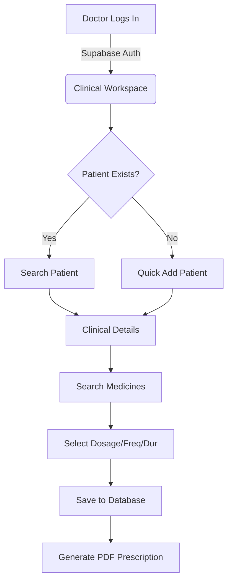

# RxNXT MVP Documentation Pack
**Confidential - For Incubator & Investor Review**

---

## 1. Product Overview
**RxNXT** is a modern, blazing-fast Digital Prescription and Drug Management platform engineered specifically for clinics and doctors in India. Designed to replace slow, error-prone paper prescriptions, RxNXT provides an intuitive digital workspace that drastically reduces prescription generation time while ensuring clinical accuracy.

## 2. Problem Statement
- **Time Inefficiency:** Doctors spend excessive time handwriting routine prescriptions or fighting with clunky, outdated Electronic Medical Records (EMRs).
- **Clinical Errors:** Handwritten prescriptions suffer from poor legibility, leading to dispensing errors at the pharmacy.
- **Data Fragmentation:** Patient histories, preferred clinic medicines, and doctor-specific favorites are disconnected, forcing doctors to repeatedly manually recall complex drug strengths and dosages.
- **High EMR Overhead:** Traditional EMRs are bloated with billing and inventory modules that solo practitioners and small clinics do not need or want.

## 3. Solution Overview
RxNXT solves this by stripping away EMR bloat and focusing exclusively on a frictionless prescription workflow. 
By leveraging a massive, normalized Drug Master database and a sub-100ms typo-tolerant search engine, doctors can instantly find medicines, auto-populate exact dosage forms and strengths, and generate professional PDFs in seconds. 

## 4. System Architecture
The platform operates on a heavily optimized, multi-tenant Serverless architecture:
- **Frontend / API:** Next.js 14 (App Router) executing on Vercel's Edge Network.
- **Backend / Database:** Supabase (PostgreSQL 15+) handling relational data and Authentication.
- **Search Engine:** Postgres `pg_trgm` (trigram) indexing combined with a pre-computed Materialized View for instant, typo-tolerant drug lookups.

## 5. User Roles
The system is built on a strict Multi-Tenant Role-Based Access Control (RBAC) foundation:
- **Clinic Admin / Receptionist (Future Expansion):** Can register patients and manage clinic-wide preferred medicines.
- **Doctor (Core MVP Focus):** Has isolated access to their specific patients, personal favorite medicines, and prescription generation tools.
- **Pharmacy (Future Expansion):** Can view validated digital prescriptions to dispense accurately.

## 6. Feature List
- **Intelligent Drug Search:** Ranks results by Doctor Favorites, Clinic Preferences, and Global Popularity. Tolerates typos (e.g., "parctml" finds "Paracetamol").
- **Smart Auto-population:** Automatically resolves generic-to-brand relationships and intelligently binds the correct Dosage Form and Strength.
- **Patient Management:** Instant search and quick-add modal for rapid patient onboarding.
- **Client-Side PDF Generation:** Instantly outputs a beautifully formatted A4 prescription without requiring heavy server-side processing or internet connectivity bottlenecks.

## 7. Workflow Diagrams

## 8. Technology Stack
- **Framework:** Next.js 14, React 18
- **Language:** TypeScript
- **Styling:** Tailwind CSS, Lucide Icons
- **Database:** PostgreSQL (via Supabase)
- **PDF Engine:** jsPDF (Client-Side)
- **Deployment:** Vercel (Frontend), Supabase (Backend), GitHub Actions (CI/CD)

## 9. Security Features
- **Zero-Trust APIs:** The frontend never sends `clinic_id` or `doctor_id`. The backend APIs securely extract tenant identity from the encrypted `@supabase/ssr` JWT session cookie.
- **Row-Level Security (RLS):** Every database query is intercepted by PostgreSQL. Doctors physically cannot query or access patients or prescriptions belonging to another clinic.
- **Audit Logging:** Database triggers automatically log `INSERT`, `UPDATE`, and `DELETE` actions on critical tables to ensure HIPAA-ready compliance trails.

## 10. Deployment Architecture
RxNXT employs a fully automated, Git-driven CI/CD pipeline:
1. Code pushed to the `main` branch triggers **GitHub Actions**.
2. **Supabase CLI** safely applies incremental database migrations (`supabase db push`).
3. **Vercel CLI** compiles the Next.js application and deploys it to the global Edge Network.
4. Automated Bash scripts ping the `/api/health` endpoint to verify database connectivity.

## 11. Future Roadmap (AI Readiness)
The database schema has been intentionally designed to support future AI modules:
- **AI Prescription Suggestions:** Analyzing chief complaints to suggest medicine protocols.
- **Drug Interaction Engine:** Cross-referencing `prescription_medicines` to warn doctors of severe interactions before saving.
- **Brand Recommendation Engine:** Suggesting lower-cost generic alternatives to branded medicines based on real-time clinic analytics.

## 12. Known MVP Limitations
To maintain a strict focus on incubator viability and fast time-to-market, the following scope boundaries exist in the MVP:
- **No Billing/Inventory:** The system focuses purely on clinical prescription generation.
- **Basic Authentication:** Relies on standard Email/Password rather than complex SSO or OTP systems.
- **No Appointment Scheduling:** Patients are created on-the-fly or selected from a flat roster, without a calendar system.
- **No Pharmacy Portal:** Prescriptions are handed to the patient via printed PDF rather than digitally routed to a pharmacy queue.
